

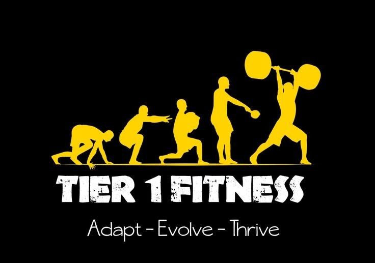

<!-- PROJECT LOGO -->

<h1 align="center">True-WellnessWay</h1>
  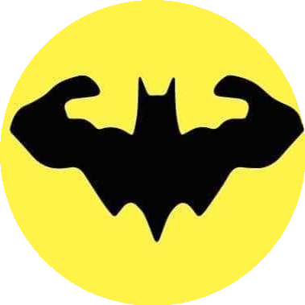
  <h3 align="center">
    Fitness & Workout   Web Application Development  International University - VNU
     
     
  </h3>

<!-- Table contents -->

# Table of Contents

- [📚 About](#about)
  - [👥 The Team Behind It](#1-the-team-behind-it)
  - [📈 The Project We Are Working On](#2-the-project-we-are-working-on)
  - [🎯 Goal](#3-goal)
- [🚀 Reason](#reason)
  - [💡 Motivation](#1-motivation)
  - [💭 Idea](#2-idea)
  - [🛤 Roadmap](#3-roadmap)
- [🛠 Technologies Used](#technologies)
- [🧩 Methodology](#methodology)
  - [🔍 Feature Analysis](#1-feature-analysis)
  - [🏗 MVVM Modern Architectural Pattern](#2-mvvm-modern-architectural-pattern)
  - [🔗 Integrating MVVM Pattern in FurniScape](#3-integrating-mvvm-pattern-in-furniscape)
- [📊 Diagrams](#diagrams)
  - [🔄 Sequence Diagrams](#1-sequence-diagrams)
  - [📐 Class Diagram](#2-class-diagram)
  - [🔧 User Interaction Diagrams](#3-user-interaction-diagrams)
  - [📜 Use Case Diagram](#4-use-case-diagram)
- [📄 License](#license)
- [📧 Contact](#contact)
- [🙏 Acknowledgements](#acknowledgements)

<!-- About -->

# 📚 ABOUT

## 1. The team behind it

| No. |       Full Name       | Student's ID |              Email               |                 Github account                  |                 Roles                  | Contribution |
| :-: | :-------------------: | :----------: | :------------------------------: | :---------------------------------------------: | :------------------------------------: | :----------: |
|  1  |     Huynh Thi Tu Chi      | ITITIU20175  | ITITIU20175@student.hcmiu.edu.vn |     [tuchihuynhxjulie](https://github.com/tuchihuynhxjulie)     | Front-end Developer |     50%      |
|  2  |     Phan Nguyen Hoang Bao      | ITITIU20165  | ITITIU20165@student.hcmiu.edu.vn |    [PhanNguyenHoangBao-ITITIU20165](https://github.com/PhanNguyenHoangBao-ITITIU20165)    |           Back-end Developer           |     50%      |
|  
## 2. The project we are working on

The fitness trading platform **True-WellnessWay** provides a comprehensive digital marketplace for individuals to buy and sell a wide range of fitness items. It includes various services such as product search, product listings, and online transactions between buyers and sellers.

The **True-WellnessWay** project offered a valuable opportunity to leverage modern web development techniques and technologies to address real-world challenges in the fitness trade industry. The team has adopted a robust Model – View – ViewModel (MVVM) architectural pattern, utilizing leading web frameworks to create a comprehensive and user-friendly e-commerce solution for the fitness marketplace.

## 3. Goal

To be short, the project aims achieve these goals:

- **Backend Development:** Utilize Node.js to create a secure and scalable server-side infrastructure, managing user authentication, product data, and transactions.

- **Frontend Development:** Implement a dynamic and responsive user interface using React.js, with Redux for efficient state management and Axios for seamless data fetching.

- **Architecture:** Adhere to the MVVM (Model-View-ViewModel) architectural pattern to separate the development of the graphical user interface from the business logic, enhancing code maintainability and scalability.

- **Database Management:** Ensure data integrity and security with a robust database solution, efficiently handling large volumes of product and user information.

- **API Integration:** Develop and integrate RESTful APIs to facilitate communication between the frontend and backend, ensuring a smooth and responsive user experience.

<!-- REASON -->

# 🚀 REASON

## 1. Motivation

The True-WellnessWay project was conceived to address the growing need for a streamlined digital platform that simplifies and
enhances the fitness trading experience. By leveraging the latest web technologies, the team aims to empower both buyers and sellers with convenient search tools, seamless booking capabilities, and secure transaction processes. The ultimate goal is to create a one-stop destination that modernizes the fitness marketplace, driving greater accessibility and economic opportunities for all participants in the industry.

## 2. Idea

The core idea behind True-WellnessWay is to create a personalized and data-driven fitness marketplace that caters to the unique preferences and needs of each user. Leveraging the power of modern web technologies, the platform will implement sophisticated recommendation algorithms powered by machine learning to analyze user browsing behavior, purchase history, and preferences, allowing it to suggest furniture items tailored to their individual taste.

Furthermore, True-WellnessWay will integrate augmented reality (AR) features that enable users to virtually place furniture items in their own workout spaces, facilitating seamless visualization of how the fitness will look and fit in their workout environment. By delivering a personalized, data-driven, and community-focused fitness marketplace, True-WellnessWay aims to revolutionize the way people discover, visualize, and purchase fitness for their health and workout spaces.

## 3. Roadmap

- [✔] Users of the forum: admin, user.
- [✔] Activities of user: read, buy, sell product; registry for the system to remind new message appearing in favor threads.
- [✔] Activities of Admin: Manage the user as well as product, create/remove user(soft remove) and product.
- [✔] Database design: 7 tables with achievement BC form.
- [ ] More to come...

<!-- Technologies Used -->

# 🛠 TECHNOLOGY

- **Backend:** NodeJS, ExpressJS

- **Frontend:** ReactJS, Redux, Axios

- **Database:** MySQL

- **Styling:** CSS, Antd

- **Version Control:** Github

- **Ide:** Visual Studio Code

<!-- METHODOLOGY -->

# 🧩 METHODOLOGY

## 1. Feature Analysis

- **User Registration and Authentication:** Users can create accounts and log in securely.

- **Product Listing and Details:** Users can browse and view detailed information about products.

- **Admin Dashboard**: When the user logs in with the patient's account, this page will appear to show all the
  operations related to them, including their recent healing sessions.

- **Add to Cart and Checkout:** Users can add products to their cart and complete the purchase process.

- **User Dashboard for Order Management:** Users can view and manage their past orders.

- **Admin Panel for Managing Products and Orders:** Admins can add, update, and delete products and manage customer orders.

## 2. MVVM modern architectural pattern

**The MVVM** (Model-View-ViewModel) pattern is a software design pattern that is used in software engineering. It is a derivation of the Model-View-Controller (MVC) pattern, and is mostly used for building user interfaces.

**Model(node.js):** The Model represents the data and the business logic of the application. It is responsible for managing the data, regardless how this data is presented to the user.

- **Data Models:** Define schemas for products, users, and admins. This involves structuring the data for each entity.

- **Business Logic:** Implement CRUD(Create, Read, Update, Delete) operations and any additional business rules or calculations necessary for the application.

**View(React.js):** The View is responsible for displaying the data to the user and capturing user interactions.

- **Component:** Create components for various parts of the application, such as product, listings, dashboard...

- **User Interface:** Design the layout and appearance of the application using Javascript and CSS, ensuring a responsive and user-friendly interface.

**ViewModel(Redux & Axios):** The ViewModel acts as an intermediary between the View and the Model. It provides data from the Model to the View and processes user interactions before sending them to the Model.

- **State Management with Redux:** Define actions, handle state changes and provide a way for components to access specific pieces of the state.

- **Data Fetching with Axios:** Use Axios to make HTTP requests to Backend, retrieving data and dispatch action based on the results of these API calls to update the state.

## 3. Integrating MVVM pattern in FurniScape

**Separation of Concerns:**

- The backend( Node.js) handles the data and business logic (Model).

- The frontend (React.js) manages the user interface (View).

- Redux and Axios bridge the gap between the two, handling state management and data fetching (ViewModel).

**Maintainability:**

- By separating the application into distinct layers (Model, View, ViewModel), each part can be developed, tested, and maintained independently.

- This separation allows for easier updates and scalability.

**Scalability:**

- As the application grows, new features can be added to each layer without impacting the others.

- The MVVM pattern facilitates adding new components, state management logic, and data handling capabilities.

<!-- Diagrams -->

# 📊 DIAGRAM

## 1. Use Case Diagram

**Description:** This diagram shows the interactions between different user types (e.g., user and admin) and the system, depicting various use cases such as finding products, adding products, ordering products, and managing feedback.

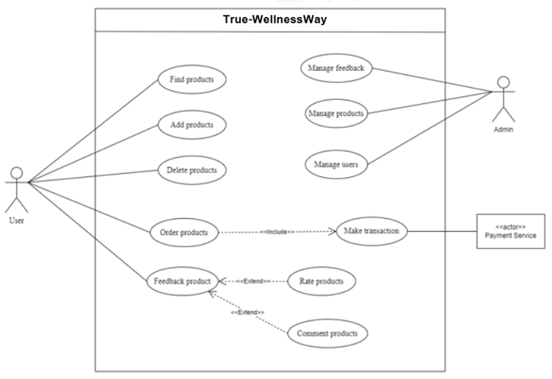

## 2. Entity-Relationship Diagram (ERD)

**Description:** The ERD depicts the data relationships between entities in the system, such as users, products, orders, and payments, helping to visualize how data is interconnected.

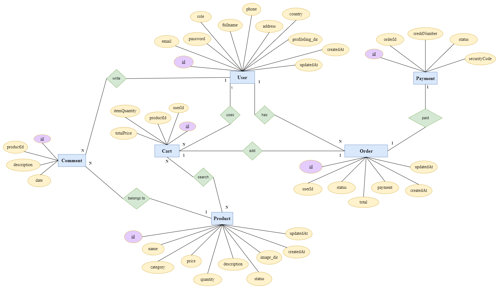

## 3. Class Diagram

**Description:** This class diagram for FurniScape includes key entities: User (manages user details and links to orders and comments), Product (contains product details and links to orders and comments), Cart (handles shopping cart functionalities), Order (details order information and links to payments), OrderDetail (provides order specifics), Comment (holds product comments), and Payment (manages payment details).

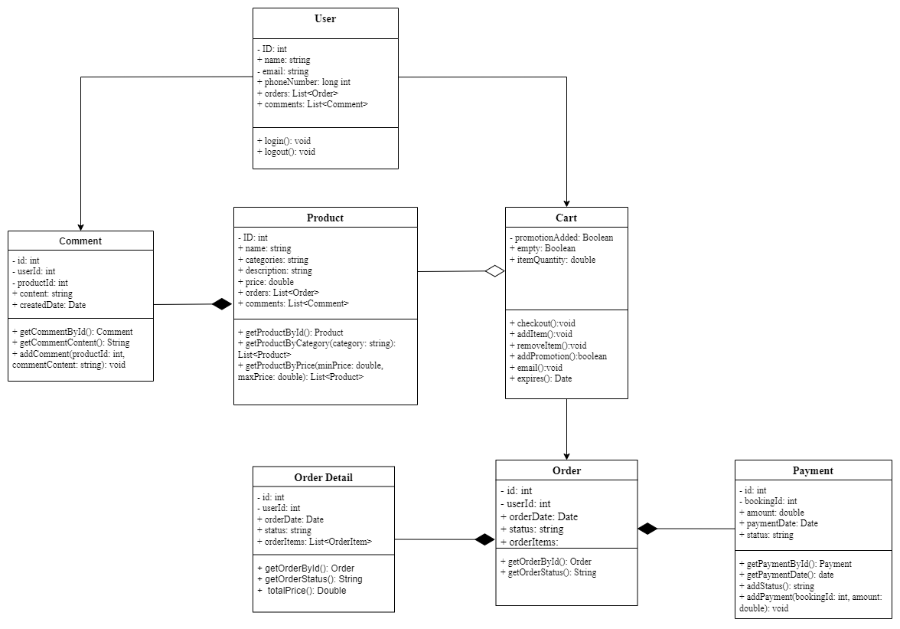

## 4. MVVM model

**Description:** The MVVM model for FurniScape has three layers. The Model manages data and business logic (e.g., Order.js, Product.js). The ViewModel processes this data and communicates changes to the View. The View includes user interface components and pages like Home.tsx and Shop.tsx, displaying data and handling user interactions.

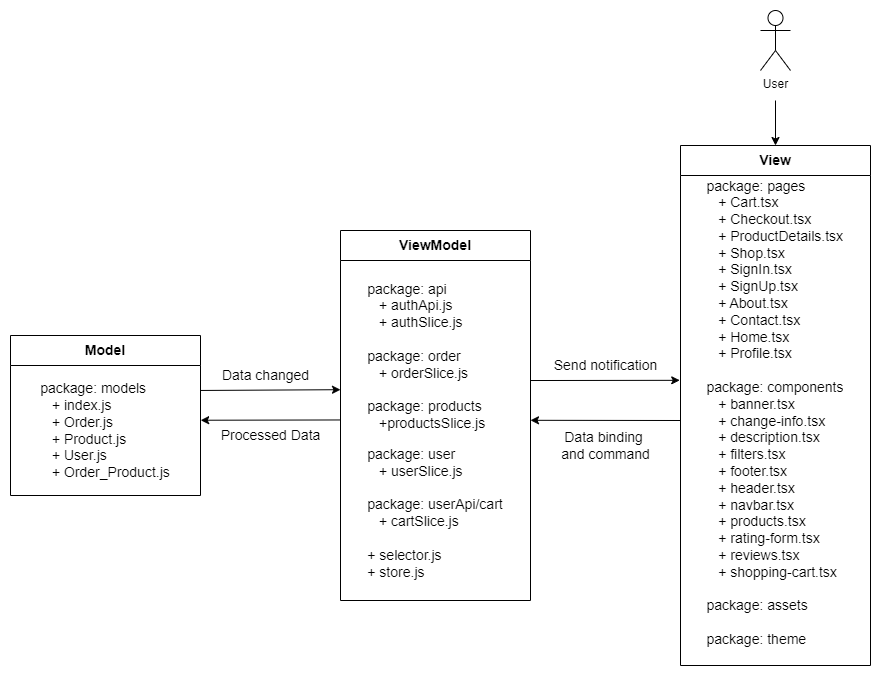

## 4. Sequence Diagrams

**User Registration:** This diagram explains the user registration process, highlighting the steps for entering user information, checking username availability, and validating the form.

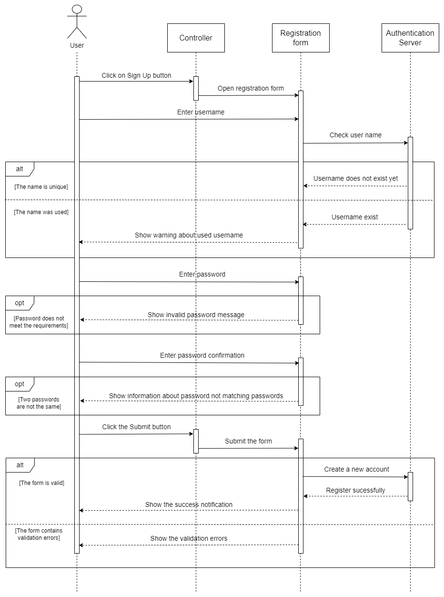

**Login Process:** This diagram outlines the user login process, showing the interactions between the user, the login form, the controller, and the database.

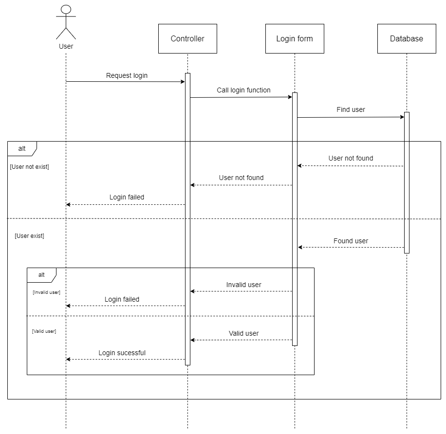

**Add product to Cart:** The diagram illustrates the process of adding a product to the cart.

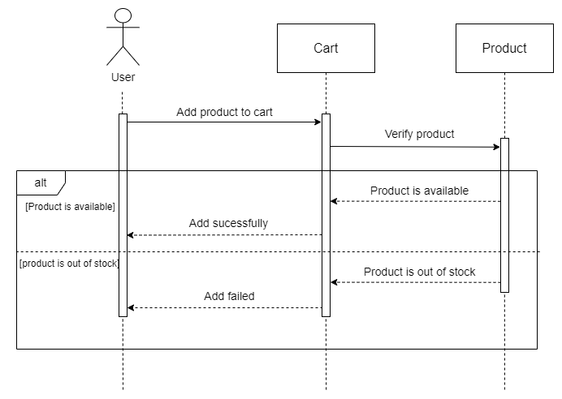

**Checkout Process:** The diagram details the checkout process. It includes steps for getting items the cart, creating an order and handling payment verification

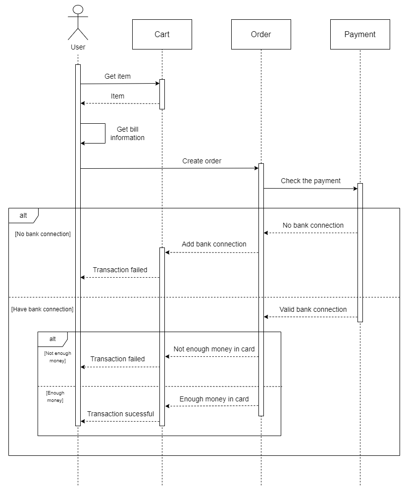

**Product Rating:** TThis diagram describes the product rating process, including checks to ensure that the product has been paid for before allowing a rating to be submitted.

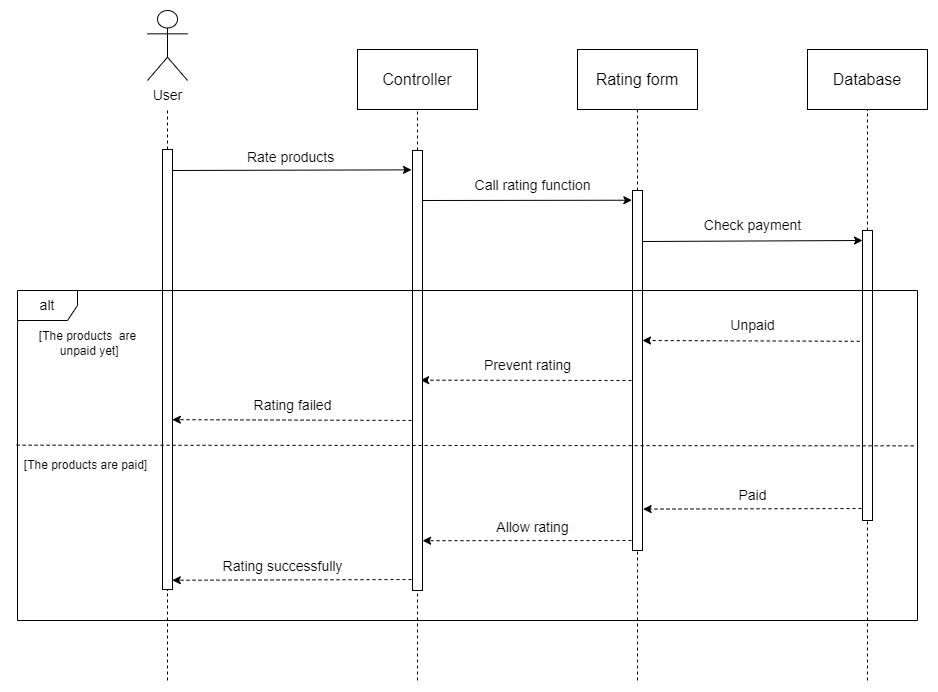

# 📄 LICENSE

This project is licensed under MIT License. See the [License](https://github.com/congbangitiu/FurniScape/blob/main/LICENSE) file for details.

<!-- CONTACT-->

# 📧 CONTACT

For any inquiries of feedback, please contact:

- **[Phan Nguyen Hoang Bao](mailto:ITITIU20165@student.hcmiu.edu.vn)**

- **[Project Link](https://github.com/PhanNguyenHoangBao-ITITIU20165/TrueWellnessWay/tree/test)**

You can also reach out to other team members:

- **[Huynh Thi Tu Chi](mailto:ITITIU20175@student.hcmiu.edu.vn)**

<!-- ACKNOWLEDGMENTS -->

# 🙏 ACKNOWLEDGEMENTS

We want to express our sincerest thanks to our lecturer and the people who have helped us to achieve this project's
goals:

-  Assoc. Prof. Nguyen Van Sinh
-  MSc. Nguyen Trung Nghia
